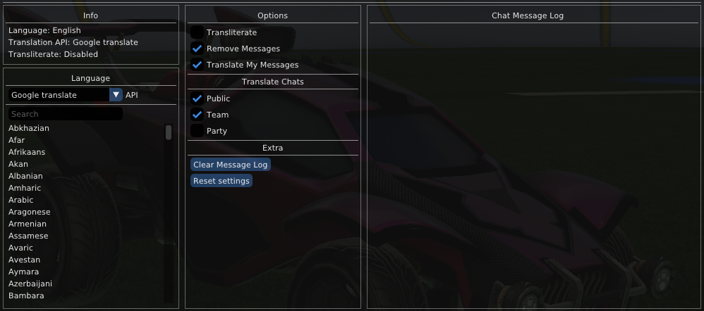

# CURRENTLY BROKEN

See: https://github.com/0xleft/trnslt/issues/10#issuecomment-3706267235

# Translate plugin for Rocket League

## Install

[Through bakkes plugins](https://bakkesplugins.com/plugins/view/413)

## Settings

## Showcase

## Thank you

Thank you to [barseghyanartur/transliterate](https://github.com/barseghyanartur/transliterate). The transliterate module in this project is basically a port of that project to C++.

## Maintainers

- [0xleft](https://github.com/0xleft)
- [Mediacy](https://github.com/ImBritish)
